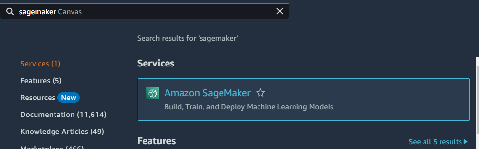
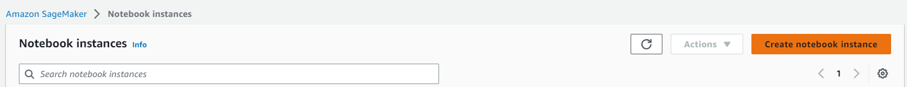
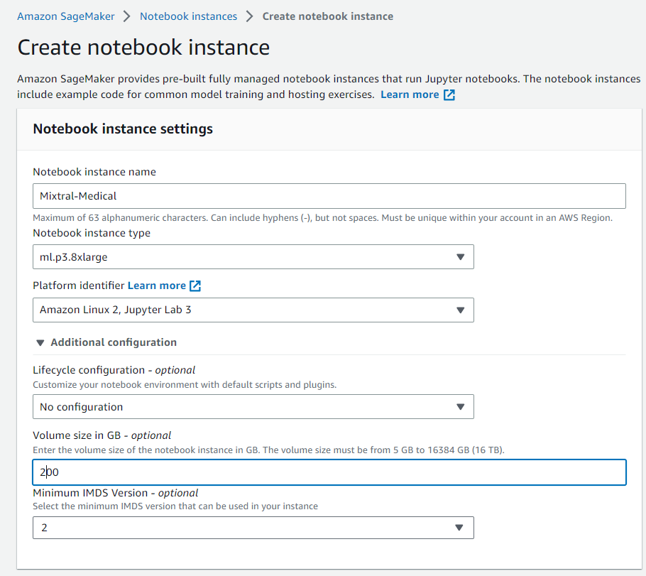
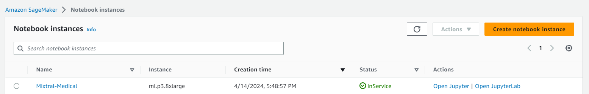
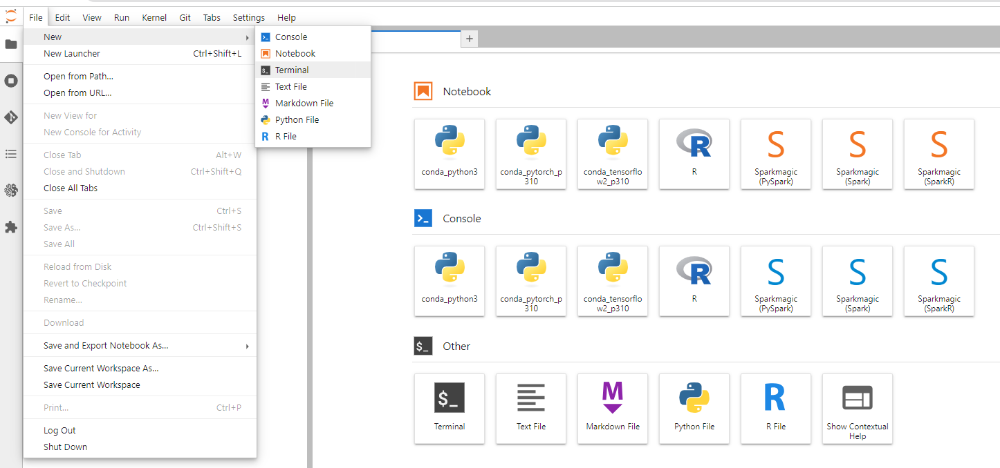
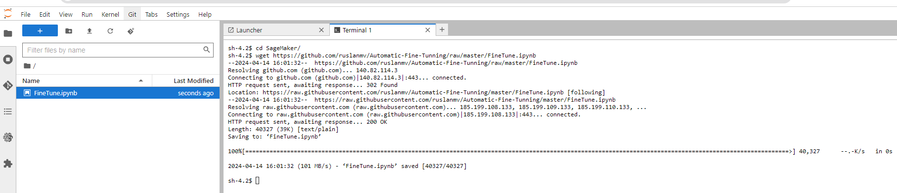
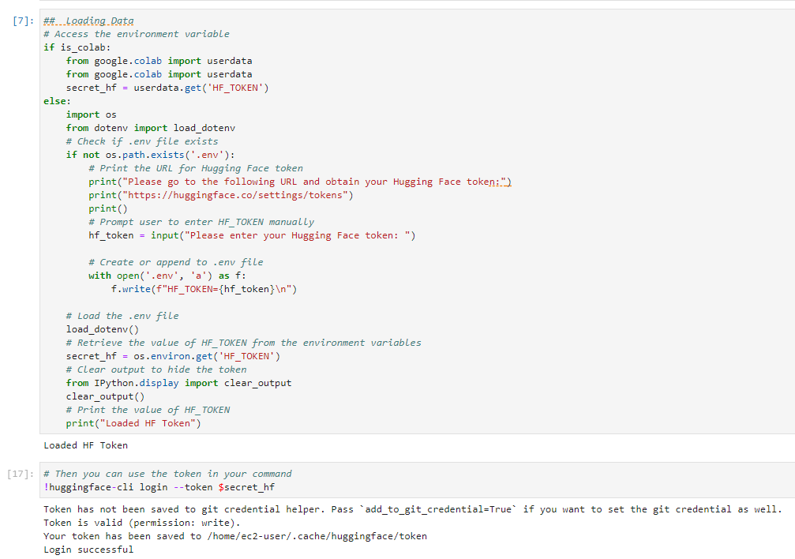
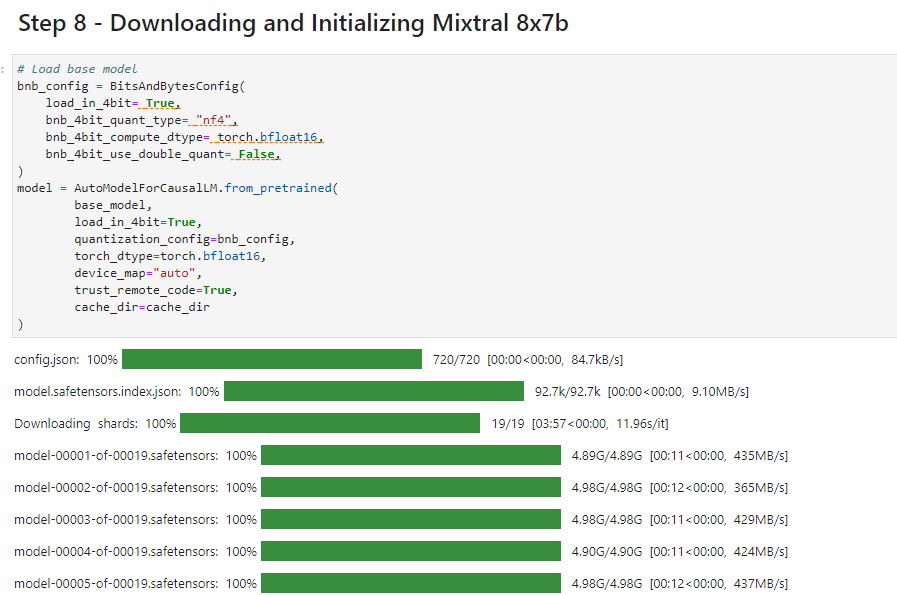

# How to Fine Tune Mixtral-8x7B-Instruct model in AWS Sagemaker / Google Colab with PEFT

Hello everyone, today we are going to Fine Tune **Mixtral-8x7B-Instruct** model for answering medical assistance questions by using PEFT Parameter-Efficient Finetuning

## Introduction

PEFT stands for Parameter-Efficient Fine-tuning. It refers to the process of fine-tuning LLMs with fewer trainable parameters, resulting in reduced GPU memory usage and slightly lower accuracy compared to fine-tuning all parameters. PEFT involves training new weights in some layers and freezing main weights. It uses low-rank decomposition matrices of the original weights to make changes. During inference, it merges the new weights with the main weights.

In this project we are going to use **SageMaker,** in particular we are going to use **ml.p4d.24xlarge** because we are going to train 

| Instance Name   | GPU Type    | Number of GPUs | Memory | Virtual CPU | Price (estimate) |
| --------------- | ----------- | -------------- | ------ | ----------- | ---------------- |
| ml.g4dn.xlarge  | NVIDIA V100 | 1              | 16 GB  | 4           | Low              |
| ml.p3.2xlarge   | NVIDIA V100 | 1              | 61 GB  | 8           | Low              |
| ml.p4d.8xlarge  | NVIDIA V100 | 2 (32 GB each) | 64 GB  | 32          | Medium           |
| ml.p3.8xlarge   | NVIDIA V100 | 4 (32 GB each) | 128 GB | 32          | Medium           |
| ml.p4d.16xlarge | NVIDIA V100 | 4              | 128 GB | 64          | High             |
| ml.p3.16xlarge  | NVIDIA V100 | 8              | 640 GB | 64          | Very High        |
| ml.p4d.24xlarge | NVIDIA A100 | 8 (40 GB each) | 320 GB | 96          | High             |

Depending of the number of tokens to be trained  we should choose the appropriate instance, for example  for 250k records  for finetune with Mixtral-8x7B we have the following estimation:

## Training Resource Estimates with Additional Details

| Instance Name   | Training Time (estimate) | Memory | Max Inference size (#params) | Max training size (#tokens) | Dataset Medical | Current Step at 2:50min | Speed (it/s) | Time Left |
| --------------- | ------------------------ | ------ | ---------------------------- | --------------------------- | --------------- | ----------------------- | ------------ | --------- |
| ml.g4dn.xlarge  | Slow                     | 16 GB  | 7B                           | 1B                          | 250k            | 17                      | 0.09         | 201:17:03 |
| ml.p3.2xlarge   | Moderate                 | 61 GB  | 7B                           | 1B                          | 250k            | 61                      | 0.34         | 52:13:07  |
| ml.p4d.8xlarge  | Moderate                 | 64 GB  | 7B                           | 1B                          | 250k            | -                       | -            | -         |
| ml.p3.8xlarge   | Fast                     | 128 GB | 14B                          | 2B                          | 250k            | 60                      | 0.34         | 52:12:43  |
| ml.p4d.16xlarge | Fast                     | 128 GB | 14B                          | 2B                          | 250k            | -                       | -            | -         |
| ml.p3.16xlarge  | Very Fast                | 640 GB | 18B                          | 2.5B                        | 250k            | -                       | -            | -         |
| ml.p4d.24xlarge | Very Fast                | 320 GB | 32B                          | 5B                          | 250k            | -                       | -            | -         |

**Note:**

- The values in the "Current Step at 2:50min", "Speed", and "Time Left" corresponds to the variables of the AI Medical Dataset 
- The "Training Time (estimate)" , "Max Inference size (#params)" and "Max training size (#tokens)" values are rough estimations. The actual numbers may vary depending on the specific model architecture, training configurations, and other factors.

Step 1 - Creation of the Instance

We login to our AWS console and then we look for Sagemaker




We go to the the menu of Sagemaker and we choose SageMaker notebooks, and then we click Create notebook instance.





We  create a new notebook instance , we named it for example `Mixtral-Medical` then we choose `ml.p3.8xlarge  `

and for Additional configuration we choose 200GB.



we keep the default settings, we are going to use the default file system and we click Create notebook instance.


then we wait that the instance becomes ready,



then we click on `Open JupyterLab` and then we click on File >Terminal




and we type the following

```
cd SageMaker
wget https://github.com/ruslanmv/Automatic-Fine-Tunning/raw/master/FineTune.ipynb
```



and then we click in `Finetune.ipynb`

## Running the Notebook

We the first notebooks,  when we ran part of HF token, we enter to [https://huggingface.co/settings/tokens](https://huggingface.co/settings/tokens) and we copy our token and paste it.



In the step 8 we are going to download the model




**Performance Improvement Strategies:**

1. Hardware Optimization:
   - If you have access to a more powerful GPU instance like ml.g5.16xlarge or ml.g5g.16xlarge, consider upgrading. These instances offer more memory and potentially faster processing for large language models.
2. Gradient Accumulation:
   - Experiment with increasing the `gradient_accumulation_steps` hyperparameter in your `TrainingArguments`. This can help reduce memory usage during training, allowing for larger batch sizes. However, it may require adjusting the learning rate to avoid overfitting.
3. Model Sparsity:
   - Libraries like Peft (used in your code) can be further explored for model sparsity techniques like Lora (Low Rank Adaptation). These techniques can potentially reduce memory usage and improve training speed.
4. Dataset Optimization:
   - Ensure your dataset is preprocessed efficiently. Techniques like tokenization and padding can be batched for improved performance. Explore libraries like `datasets` for efficient dataset handling.
5. Distributed Training (Optional):
   - If you have multiple GPUs available, consider using distributed training frameworks like Horovod or DeepSpeed to leverage multiple machines for faster training.

**Additional Tips:**

- Monitor memory usage during training to identify potential bottlenecks. If memory is a significant constraint, consider reducing the batch size or exploring techniques like gradient accumulation.
- Experiment with different hyperparameter settings (learning rate, batch size, etc.) to find the optimal configuration for your dataset and hardware. Tools like Hugging Face's TrainingArguments and Accelerate library can help you manage hyperparameters effectively.
- Regularly save checkpoints during training to allow for resuming training if necessary.

By addressing the warnings, exploring the optimization strategies, and fine-tuning your hyperparameters, you should be able to improve the performance of your Mistral-7B-Instruct-v0.2 fine-tuning process.

## How to run the Notebook in the Background

**Method 1: Detaching the Kernel**

This method focuses on stopping the execution of code within the Jupyter notebook itself but allows background processes like training to continue.

To run a Jupyter notebook on AWS SageMaker without ending the session when closing your personal computer and later restore the session to check progress, follow these steps:

**Steps to initialize the run process:**

1. Open your `FineTune.ipynb` notebook in Jupyter Lab within SageMaker.
2. Run the notebook by clicking the "Run" button or using the "Shift + Enter" keyboard shortcut to execute each cell one by one, that initiate the model fine-tuning process.

1. Detach the kernel to allow the background processes, such as model training, to continue running after closing your personal computer:

   a. Navigate to the Cell menu in the top toolbar.

   b. Select Kernel -> Shut Down Kernel. This action stops the current kernel execution but allows the background processes to continue running.

2. Close your personal computer. The training process will continue running in the background within SageMaker.

3. When you want to check the progress of your notebook:

   a. Open your personal computer and log in to your AWS SageMaker account.

   b. Navigate to the Jupyter Lab environment and open your finetune.ipynb notebook.

   c. Reconnect to the kernel by navigating to the Cell menu in the top toolbar and selecting Kernel -> Connect to Kernel.

4. You should now be able to see the progress of your notebook and interact with it as needed.

Note: Implement checkpointing mechanisms within your finetune.ipynb code to save the model's state periodically. This allows you to resume training from the latest checkpoint if necessary. For more robust and scalable background execution, consider using SageMaker Processing Jobs for future runs.

**Method 2: Using the Terminal (Optional)**

This method leverages the `screen` command to create a detached session where your training can run independent of your terminal window.

**Steps to initialize the run process:**

1. Open your `finetune.ipynb` notebook and run the code that starts the training process.

**Steps to close your computer:**

1. Open a terminal window within your SageMaker notebook instance (usually from the top bar or "New" menu).
2. Run the command:

Bash

```
screen -d -S my_session bash  # Replace 'my_session' with a desired name
```

**Reconnecting to a Detached Session (Optional)**

If you need to monitor progress later:

Bash

```
screen -r my_session  # Replace 'my_session' with the actual name you used
```

**Additional Tips:**

- **Checkpoint Your Training:**  Incorporate code to save the model state periodically. This allows resuming training from the latest checkpoint if needed.
- **SageMaker Processing Jobs (Consider This for Future Runs):** Explore Processing Jobs for a more robust and scalable approach. They manage the training lifecycle, freeing you from manual detachment.

**Waking Up and Checking Progress:**

1. Open a new terminal window in your SageMaker instance (if using Method 1) or reconnect to the detached session using `screen -r my_session` (if using Method 2).
2. Within the terminal or Jupyter notebook, you can monitor logs or access the model files to see training progress.

**Method 3: SageMaker Processing Jobs  (Optional)**

If are interested to run this notebook in background without be on the noteobok, we can use SageMaker Processing Jobs 

This is the preferred approach as it's fully managed by SageMaker, providing scalability, monitoring, and logging capabilities.

1. **Convert Notebook to Script (Optional):**
   - For complex notebooks with extensive dependencies or interactivity, consider converting them to a well-structured Python script (`fine_tuning.py`). This simplifies the execution process.
2. **Create a Processing Job:**
   - Go to the SageMaker console and navigate to **Processing**.
   - Click **Create processing job**.
   - Provide a name (e.g., "FineTuningJob").
   - Under **Appplication image configuration**, choose **Bring your own** and specify a Docker image containing your Python environment and dependencies. If you don't have one, you can create a simple image using `Dockerfile` and build it using `docker build`.
   - Under **Processing script or notebook**, choose **Script file** if you converted your notebook, or **File** if it remains a notebook. Select the appropriate file from S3 or upload it.
   - Configure other job parameters (e.g., instance type, role, output location) as needed. Notably:
     - Set **Instance type** to `ml.p3.2xlarge`.
     - Under **Role**, choose a role with permissions to access S3 buckets containing your notebook and output data.
3. **Submit the Job:**
   - Review the configuration and click **Create**.